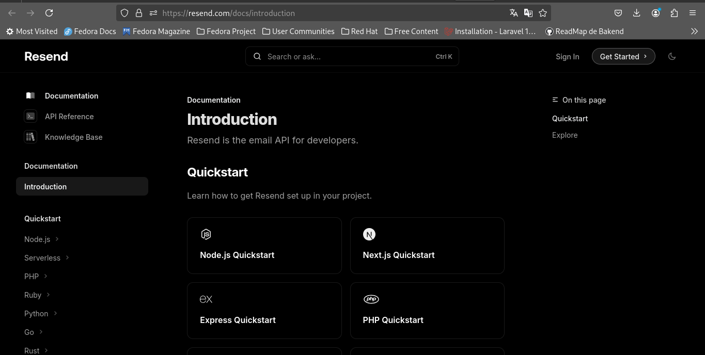
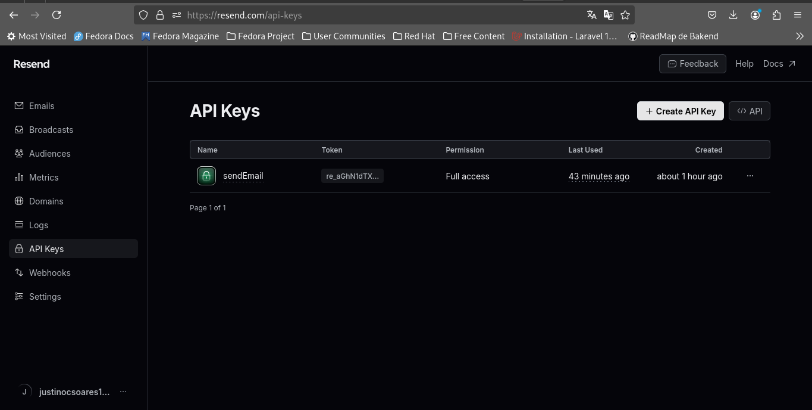

# Como enviar email com nodejs, de forma fácil e grátis

Se você é um deve que andou a procura por uma forma fácil de enviar email através da tua aplicação nodejs(e não só), aque apresento uma solução simples com o Resend.
- Acesse o site do Resend  <i> https://resend.com/docs/introduction <i> e crie uma conta

</img>
- Cria uma conta
- Vá para a sessão API keys, e cria uma chave de API

</img>

- Agora basta criar um arquivo com a extensão .js

```sh
npm init
npm install resend
```

```js
const Resend = require('resend');

const resend = new Resend('re_aGhN1...');

await resend.emails.send({
  from: 'Justino <onboarding@resend.dev>',
  to: ['seuemail@gmail.com'],
  subject: 'hello world',
  html: '<h1>Olá sou o Justino seja você mesmo</h1>',
}).then(response => {
    console.log(response);
    console.log("Tudo certo");
}
    
).catch(err =>
    console.log(err),
);
```
